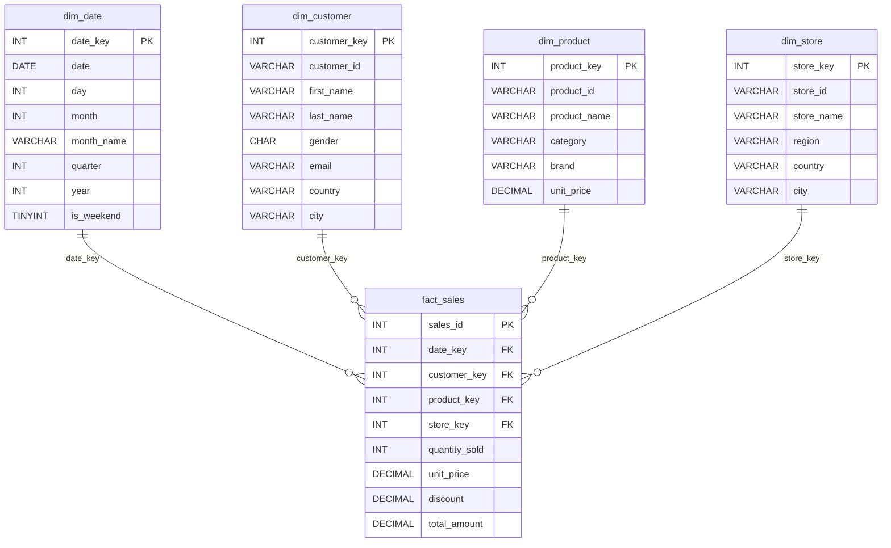

# 📘 SQL Learning Journey (MySQL)

A comprehensive, chapter-by-chapter SQL learning repository built with **MySQL**. Each file progressively covers core-to-advanced SQL concepts with hands-on, commented examples using a realistic **e-commerce star-schema** dataset.

---

## 📂 Repository Structure

```
SQL/
├── chapter_1.sql      → Database & Table Basics
├── chapter-2.sql      → Star-Schema Dataset (Dimension & Fact Tables)
├── Chapter-3.sql      → SELECT, WHERE, LIKE, Sorting, Aliases & Grouping
├── chapter-4.sql      → Joins & Unions
├── Chapter-5.sql      → DML Commands (INSERT, UPDATE, DELETE)
├── Chapter-6.sql      → Data Transformations (Numeric, Date, String)
├── Chapter-7.sql      → Conditional Logic (CASE)
├── Chapter-8.sql      → Window Functions & Ranking
├── Chapter-9.sql      → Subqueries
├── Chapter-10.sql     → Common Table Expressions (CTEs)
├── Chapter-11.sql     → Real-Time Scenarios (Nth Value, Dedup, Lag/Lead)
├── Chapter-12.sql     → Views
├── Chapter-13.sql     → Stored Procedures
├── Chapter-14.sql     → User-Defined Functions
└── README.md
```

---

## 📖 Chapter-by-Chapter Breakdown

### Chapter 1 — Database & Table Basics
**File:** `chapter_1.sql`

| Topic | Description |
|---|---|
| `CREATE DATABASE` | Creates the `sales` database |
| `CREATE TABLE` | Creates tables with columns (`INT`, `VARCHAR`) |
| `INSERT INTO` | Inserts rows — full-row and selected-column inserts |
| Constraints | `UNIQUE`, `NOT NULL` |
| `DROP TABLE` | Deletes an entire table |
| `TRUNCATE TABLE` | Removes all data but keeps the table structure |
| `ALTER TABLE` | Adds and renames columns |

---

### Chapter 2 — Star-Schema Dataset
**File:** `chapter-2.sql`

Sets up the complete **e-commerce data warehouse** used throughout the remaining chapters.

| Table | Type | Key Columns |
|---|---|---|
| `dim_date` | Dimension | `date_key`, `date`, `month_name`, `quarter`, `year`, `is_weekend` |
| `dim_customer` | Dimension | `customer_key`, `first_name`, `last_name`, `gender`, `email`, `country`, `city` |
| `dim_product` | Dimension | `product_key`, `product_name`, `category`, `brand`, `unit_price` |
| `dim_store` | Dimension | `store_key`, `store_name`, `region`, `country`, `city` |
| `fact_sales` | Fact | `sales_id`, `quantity_sold`, `unit_price`, `discount`, `total_amount` + foreign keys |

> [!NOTE]
> This file is ~6,800 lines because it includes all the `INSERT` statements to populate the tables with sample data.

---

### Chapter 3 — SELECT, Filtering, Sorting & Grouping
**File:** `Chapter-3.sql`

- **`SELECT`** — Basic queries and `LIMIT`
- **`WHERE`** — Filtering with conditions (`=`, `AND`, `OR`)
- **`LIKE`** — Pattern matching using `%` (wildcard) and `_` (single char position)
- **`ORDER BY`** — Sorting results (`ASC` / `DESC`)
- **`AS` (Aliases)** — Renaming columns in the output
- **`GROUP BY`** — Aggregating with `AVG()`, `SUM()`
- **`HAVING`** — Filtering on aggregate results

---

### Chapter 4 — Joins & Unions
**File:** `chapter-4.sql`

Creates `orders` and `customers` tables, then demonstrates:

| Join Type | Description |
|---|---|
| `INNER JOIN` | Returns only matching rows from both tables |
| `LEFT JOIN` | All rows from left table + matching from right |
| `RIGHT JOIN` | All rows from right table + matching from left |
| `FULL JOIN` | Not supported in MySQL |
| `UNION` | Combines `LEFT JOIN` + `RIGHT JOIN` to simulate a full outer join |

---

### Chapter 5 — DML Commands
**File:** `Chapter-5.sql`

| Command | Example |
|---|---|
| `UPDATE` | Changes `name` to `'sam'` where `email = 'aa'` |
| `DELETE` | Removes a row based on a `WHERE` condition |

---

### Chapter 6 — Data Transformations
**File:** `Chapter-6.sql`

**Numeric Transformations**
- Arithmetic: `*, +, /`
- `ROUND()`

**Date Transformations**
- `NOW()`, `UTC_DATE()`, `UTC_TIME()`, `UTC_TIMESTAMP()`
- `YEAR()`, `MONTH()`, `DAY()`, `WEEKDAY()`, `DAYNAME()`
- `DATEDIFF()`, `ADDDATE()`, `SUBDATE()`
- `CAST()` — type casting
- `DATE_FORMAT()` — custom date formatting

**String Functions**
- `CONCAT()`, `CONCAT_WS()`
- `LENGTH()`, `LOWER()`
- `SUBSTRING()`, `REPLACE()`
- `LEFT()`, `RIGHT()`, `REVERSE()`, `REPEAT()`

---

### Chapter 7 — Conditional Logic (CASE)
**File:** `Chapter-7.sql`

- Simple `CASE WHEN … THEN … ELSE … END` for price categorisation
- Compound conditions with `AND` to combine category and price thresholds
- Using `CONCAT()` inside `ELSE` for dynamic fallback labels

---

### Chapter 8 — Window Functions & Ranking
**File:** `Chapter-8.sql`

**Running Aggregates**
- `SUM() OVER(ORDER BY …)` — cumulative sum
- Frame clauses: `ROWS BETWEEN UNBOUNDED PRECEDING AND CURRENT ROW` vs `UNBOUNDED FOLLOWING`

**Ranking**
- `ROW_NUMBER()` — unique sequential number
- `RANK()` — allows gaps on ties
- `DENSE_RANK()` — no gaps on ties
- `PARTITION BY` — ranking within category groups

---

### Chapter 9 — Subqueries
**File:** `Chapter-9.sql`

- **Scalar subquery in `WHERE`** — e.g. `WHERE unit_price > (SELECT AVG(unit_price) …)`
- **Derived table (inline view)** — subquery in the `FROM` clause with an alias

---

### Chapter 10 — Common Table Expressions (CTEs)
**File:** `Chapter-10.sql`

- `WITH cte_table AS (…)` — named temporary result set
- **Chained CTEs** — one CTE referencing another (`cte_table_2` inherits from `cte_table`)
- Cleaner alternative to deeply nested subqueries

---

### Chapter 11 — Real-Time Scenarios
**File:** `Chapter-11.sql`

| Scenario | Technique Used |
|---|---|
| Finding the N-th value per category | `DENSE_RANK()` + `PARTITION BY` in a subquery |
| Removing duplicate rows | `ROW_NUMBER()` + `PARTITION BY` to keep only `dedup = 1` |
| Comparing previous/next rows | `LAG()` and `LEAD()` window functions on a `weather` table |

---

### Chapter 12 — Views
**File:** `Chapter-12.sql`

- `CREATE VIEW` — saves a reusable query (no data stored, just the definition)
- Demonstrates creating a `dedup_view` and querying it with `SELECT * FROM dedup_view`

---

### Chapter 13 — Stored Procedures
**File:** `Chapter-13.sql`

- `DELIMITER //` — changing the statement delimiter
- `CREATE PROCEDURE` — defines a procedure with `IN` parameters
- `CALL` — executing the procedure to insert a new customer row

---

### Chapter 14 — User-Defined Functions
**File:** `Chapter-14.sql`

- `CREATE FUNCTION` — defines a reusable `square_it(x)` function
- `DETERMINISTIC` keyword
- Using the custom function inside a `SELECT` statement

---

## 🗄️ Database Schema (ER Diagram)



---

## 🚀 How to Use

1. **Clone** the repository.
2. Open the `.sql` files in **MySQL Workbench** (or any MySQL client).
3. Run `chapter-2.sql` **first** to set up the database and sample data.
4. Work through the remaining chapters in order — each builds on the previous.

---

## 🛠️ Prerequisites

- **MySQL** 8.0+ (or compatible)
- **MySQL Workbench** (recommended) or any SQL client

---

## ✍️ Author

**Gaurav**
